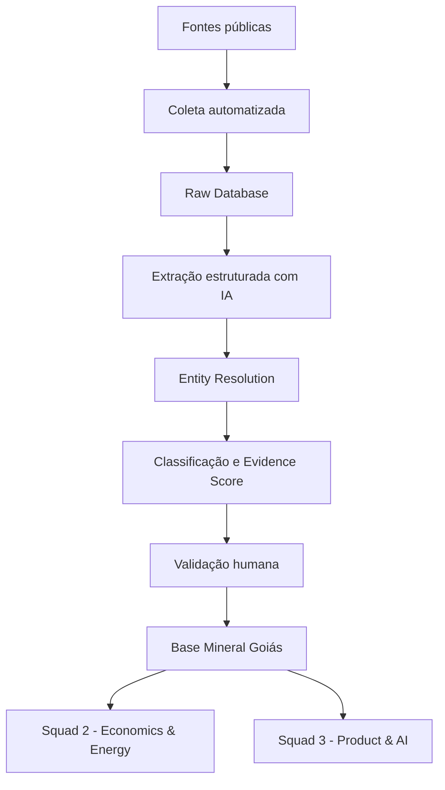
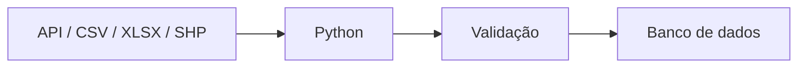
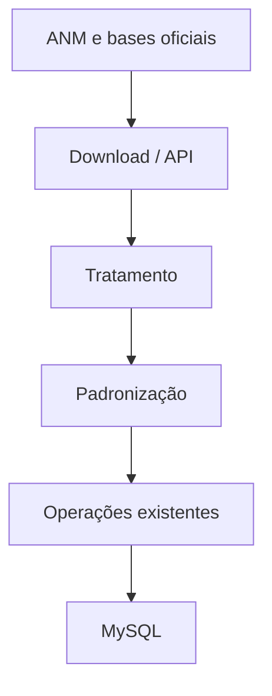
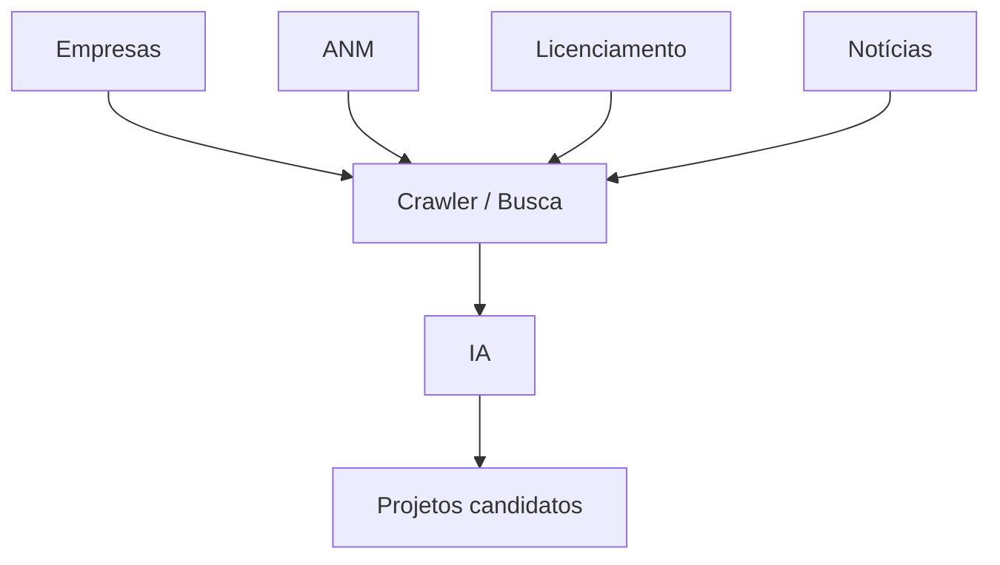
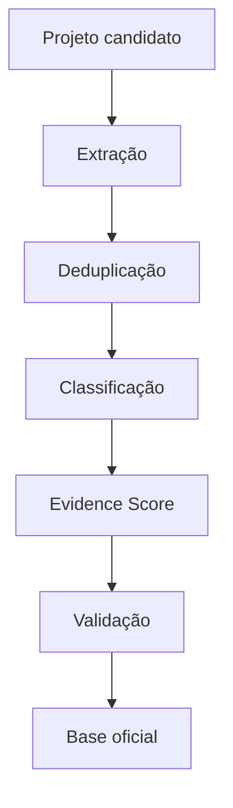
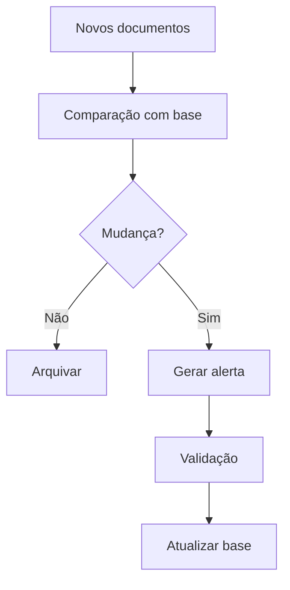

# Squad 1 — Mineral & Data Intelligence

## Projeto: MINERA Goiás — Inteligência Mineral-Energética

Este documento apresenta o planejamento técnico e operacional do **Squad 1 — Mineral & Data Intelligence**, responsável por construir a base de dados de operações e projetos minerais que alimentará os módulos econômicos, energéticos e tecnológicos do projeto.

O objetivo do Squad 1 é transformar dados públicos dispersos em uma **base estruturada, rastreável, validada e atualizável**, com apoio de IA para busca, extração, consolidação e classificação de informações.

---

## 1. Objetivo do Squad 1

Construir uma base consolidada de operações e projetos minerais de Goiás contendo, sempre que disponível:

- empresa;
- projeto/operação;
- mineral;
- município;
- localização;
- produção;
- capacidade produtiva;
- reservas e recursos;
- estágio do projeto;
- cronograma;
- rota tecnológica;
- evidências associadas;
- fonte;
- data da informação;
- nível de confiança;
- responsável pela validação.

A base será o principal input para:

- **Squad 2 — Economics & Energy:** cenários de produção mineral, elasticidades, intensidade energética e projeção de consumo;
- **Squad 3 — Product & AI:** banco de dados, frontend, mapa, radar de projetos, simulador e mecanismos de atualização.

---

## 2. Princípio de automação

A solução não deve depender de um único agente autônomo.

A arquitetura recomendada é um **workflow automatizado e modular**, no qual:

- código tradicional executa tarefas determinísticas;
- IA trabalha sobre informação não estruturada;
- regras explícitas calculam classificações e scores;
- humanos validam informações críticas.

Fluxo principal:



---

# 3. Fontes de dados

## 3.1 Fontes prioritárias

### ANM
Utilizar bases da Agência Nacional de Mineração para:

- processos minerários;
- substância mineral;
- titular;
- município;
- coordenadas;
- fase do processo;
- situação;
- área;
- produção mineral;
- arrecadação;
- reservas e recursos quando disponíveis.

### SIGMINE e bases geológicas

Levantar:

- processos minerários;
- depósitos;
- ocorrências minerais;
- localização geográfica;
- recursos geológicos;
- informações espaciais.

### Empresas

Monitorar prioritariamente:

- Investor Relations;
- relatórios anuais;
- press releases;
- apresentações para investidores;
- relatórios de sustentabilidade;
- resultados trimestrais;
- guidance corporativo;
- páginas de projetos.

### Licenciamento ambiental

Buscar:

- licenças prévias;
- licenças de instalação;
- licenças de operação;
- estudos ambientais;
- audiências públicas;
- mudanças no estágio regulatório.

### Fontes complementares

- IBRAM;
- secretarias estaduais;
- órgãos ambientais;
- imprensa especializada;
- portais de negócios;
- bases de investimentos;
- documentos governamentais.

> Fontes de imprensa devem ser usadas principalmente como camada de descoberta. Sempre que possível, a informação deve ser confirmada em fonte primária.

---

# 4. Arquitetura do pipeline

## 4.1 Etapa 1 — Data ingestion

Criar collectors independentes por fonte.

Exemplos:

```text
ANM Collector
Company Collector
Licensing Collector
News Collector
Geological Data Collector
```

Sempre que houver:

- API;
- CSV;
- Excel;
- shapefile;
- banco estruturado;

a coleta deve ser feita diretamente por código, sem uso de IA.

Fluxo:



---

## 4.2 Etapa 2 — Raw Database

Antes de interpretar a informação, armazenar o material original.

Guardar:

- documento;
- URL;
- fonte;
- data de publicação;
- data de coleta;
- hash do arquivo;
- tipo de documento;
- empresa relacionada;
- metadados.

Isso permite:

- auditoria;
- reprocessamento;
- comparação histórica;
- rastreabilidade.

---

## 4.3 Etapa 3 — Extração estruturada com IA

A IA deve transformar documentos não estruturados em registros estruturados.

Exemplo de saída:

```json
{
  "empresa": "Empresa X",
  "projeto": "Projeto Y",
  "mineral": "Cobre",
  "municipio": "Alto Horizonte",
  "tipo": "Expansao",
  "capacidade_t_ano": 50000,
  "inicio_previsto": 2031,
  "capex": 1200000000,
  "estagio": "Viabilidade",
  "tecnologia": null,
  "fonte": "Relatorio anual",
  "data_fonte": "2026-08-15",
  "pagina": 74
}
```

A extração deve usar:

- JSON Schema;
- structured outputs;
- function calling;
- regras de validação de tipos e unidades.

---

# 5. Unidade observacional

A unidade principal da base será:

> **Projeto / ativo mineral**

Cada projeto deve possuir um identificador permanente.

Exemplo:

```text
GO_MIN_0001
GO_MIN_0002
GO_MIN_0003
```

Isso permite acompanhar o mesmo ativo ao longo do tempo.

Exemplo:

```text
GO_MIN_0001

2024 -> Pesquisa avançada
2025 -> Viabilidade
2026 -> Licenciamento
2027 -> Construção
2029 -> Operação
```

---

# 6. Estrutura mínima da base

## 6.1 Tabela `projects`

| Campo | Descrição |
|---|---|
| project_id | ID único |
| project_name | Nome padronizado |
| company_id | Empresa |
| mineral_id | Mineral |
| municipality | Município |
| latitude | Latitude |
| longitude | Longitude |
| project_type | Operação, expansão, greenfield etc. |
| stage | Estágio atual |
| capacity | Capacidade |
| production | Produção |
| expected_start | Ano esperado de entrada |
| technology | Rota tecnológica |
| status | Ativo, suspenso, cancelado etc. |
| confidence | Confiança |
| last_update | Última atualização |

---

## 6.2 Tabela `evidence`

| Campo | Descrição |
|---|---|
| evidence_id | ID da evidência |
| project_id | Projeto relacionado |
| evidence_type | Tipo de evidência |
| value | Informação extraída |
| source_id | Fonte |
| publication_date | Data da fonte |
| extracted_text | Trecho relevante |
| page | Página |
| extraction_method | Manual / IA / API |
| validation_status | Pendente / aprovado / rejeitado |
| validated_by | Responsável |

---

## 6.3 Tabela `sources`

| Campo | Descrição |
|---|---|
| source_id | Identificador |
| source_type | ANM, empresa, notícia etc. |
| organization | Instituição |
| title | Documento |
| url | Endereço |
| publication_date | Data |
| collected_at | Data de coleta |
| file_hash | Hash |
| reliability_level | Nível da fonte |

---

# 7. Entity Resolution

Um mesmo projeto pode aparecer com nomes diferentes.

Exemplo:

```text
Projeto Mara Rosa
Posse Gold Project
Hochschild Goiás Operation
```

O sistema deve comparar:

- empresa;
- mineral;
- município;
- coordenadas;
- subsidiária;
- capacidade;
- descrição;
- aliases conhecidos.

A IA pode sugerir:

```text
Probabilidade de correspondência: 97%
```

Regra:

> A IA pode sugerir fusão de registros, mas a decisão final de merge deve ser validada por humano quando houver ambiguidade relevante.

---

# 8. Classificação dos projetos

Classificação recomendada:

1. Operação ativa
2. Expansão brownfield
3. Construção
4. Licenciamento
5. Viabilidade / desenvolvimento
6. Pesquisa avançada
7. Pesquisa / ocorrência
8. Sinal

A IA pode sugerir a categoria com base nas evidências encontradas.

Exemplo:

```text
Texto identificado:
"The company has commenced earthworks and ordered the primary crusher."

Classificação sugerida:
Construção

Evidências:
- início de obras
- contratação/compra de equipamento

Confiança:
Alta
```

---

# 9. Evidence Score

O objetivo do score é medir a robustez das evidências de maturidade de um projeto, sem pedir à IA que "adivinhe" se ele acontecerá.

Uma forma simples é:

```math
S_p = \sum_{j=1}^{J} w_j I_{pj}
```

Onde:

- `S_p` = score de evidências do projeto `p`;
- `w_j` = peso atribuído ao tipo de evidência `j`;
- `I_pj` = indicador igual a 1 quando o projeto `p` possui a evidência `j`, e 0 caso contrário;
- `J` = número total de tipos de evidência considerados.

Exemplo inicial de pesos:

| Evidência | Pontos |
|---|---:|
| Processo minerário | 5 |
| Recurso/reserva divulgado | 10 |
| Estudo de viabilidade | 15 |
| Licença ambiental relevante | 15 |
| CAPEX anunciado | 10 |
| Financiamento | 15 |
| Equipamentos contratados | 10 |
| Obras iniciadas | 15 |
| Guidance de início | 5 |

Os pesos devem ser discutidos e validados pela equipe técnica.

---

# 10. Human-in-the-loop

A IA deve operar como pré-triagem.

Criar três níveis de revisão:

### Verde — Auto-accept

Usar quando:

- dado estruturado;
- fonte oficial;
- campo inequívoco;
- regra determinística.

### Amarelo — Review

Usar quando:

- informação extraída de texto;
- pequena ambiguidade;
- nova informação de projeto existente;
- mudança de capacidade ou cronograma.

### Vermelho — Manual Review

Usar quando:

- fontes conflitantes;
- projeto possivelmente duplicado;
- informação não confirmada;
- unidade inconsistente;
- classificação incerta;
- projeto novo de grande impacto.

---

# 11. Agentes recomendados

## Agent 1 — Discovery

Objetivo:

- encontrar documentos;
- identificar possíveis projetos;
- localizar novas evidências.

Input:

```text
empresa
mineral
territorio
fontes permitidas
```

Output:

```text
lista de documentos potencialmente relevantes
```

---

## Agent 2 — Extraction

Objetivo:

Extrair:

- empresa;
- projeto;
- mineral;
- município;
- estágio;
- capacidade;
- cronograma;
- CAPEX;
- tecnologia;
- produção.

Output:

```json
{
  "project": "...",
  "company": "...",
  "mineral": "...",
  "stage": "...",
  "capacity": "...",
  "expected_start": "...",
  "source": "..."
}
```

---

## Agent 3 — Evidence

Objetivo:

Identificar evidências como:

- licença;
- estudo de viabilidade;
- recurso/reserva;
- financiamento;
- CAPEX;
- contratação;
- compra de equipamentos;
- obras;
- guidance.

---

## Agent 4 — Entity Resolution

Objetivo:

Decidir se a informação:

```text
A) pertence a projeto existente
B) representa novo projeto
C) é ambígua
```

---

## Agent 5 — Quality Control

Objetivo:

Detectar:

- conflitos;
- duplicidades;
- fontes antigas;
- unidades inconsistentes;
- valores fora do padrão;
- campos obrigatórios faltantes.

---

# 12. Change Detection

Após a carga inicial, o sistema deve priorizar detecção de mudanças.

Exemplo:

```text
Relatório Q2/2026

Projeto X
Capacidade: 100 kt/ano
Startup: 2030
```

Novo documento:

```text
Relatório Q3/2026

Projeto X
Capacidade: 120 kt/ano
Startup: 2031
```

Saída automática:

```text
CHANGE DETECTED

Projeto: X

Capacidade:
100 -> 120 kt/ano

Entrada prevista:
2030 -> 2031

Fonte:
Q3 2026 Investor Presentation
```

A mudança segue para validação antes de atualizar o valor oficial da base.

---

# 13. Processos principais

## Processo A — Mining Baseline



---

## Processo B — Project Discovery



---

## Processo C — Project Intelligence



---

## Processo D — Monitoring



---

# 14. Stack tecnológica sugerida

| Camada | Tecnologia |
|---|---|
| Linguagem principal | Python |
| APIs / coleta | Requests / HTTPX |
| Navegação web | Playwright |
| Tratamento de dados | Pandas / Polars |
| IA | OpenAI API |
| Structured Output | JSON Schema / Function Calling |
| Orquestração | Prefect ou n8n |
| Backend | FastAPI |
| Banco | MySQL |
| Frontend | React |
| Estilização | Tailwind |
| Versionamento | GitHub |
| Containerização | Docker |
| CI/CD | GitHub Actions |

---

# 15. O que não deve ser feito pela IA

A IA não deve:

- inventar valores faltantes;
- substituir fontes primárias por notícias quando houver informação oficial;
- decidir sozinha se um projeto acontecerá;
- atribuir probabilidade econômica sem metodologia;
- sobrescrever dado validado automaticamente;
- unir projetos ambíguos sem revisão;
- utilizar informação sem registrar a fonte.

Campos sem informação devem permanecer explicitamente como:

```text
null
```

ou:

```text
não disponível
```

Quando proxies ou estimativas forem utilizadas, devem ser identificadas separadamente.

---

# 16. Dados faltantes

A abordagem recomendada é:

```text
Dado ausente
    ↓
Busca adicional
    ↓
Existe fonte?
    ├── Sim -> extrair e validar
    └── Não
          ↓
    Existe proxy defensável?
          ├── Sim -> registrar como estimativa
          └── Não -> manter ausente
```

Machine Learning não deve ser utilizado automaticamente para preencher lacunas sem justificativa econômica, tecnológica ou estatística.

---

# 17. Estrutura sugerida do repositório

```text
minera-goias/
│
├── README.md
├── docs/
│   ├── methodology.md
│   ├── data_dictionary.md
│   ├── evidence_score.md
│   └── validation_rules.md
│
├── config/
│   ├── sources.yaml
│   ├── minerals.yaml
│   └── companies.yaml
│
├── data/
│   ├── raw/
│   ├── processed/
│   └── examples/
│
├── collectors/
│   ├── anm/
│   ├── companies/
│   ├── licensing/
│   └── news/
│
├── agents/
│   ├── discovery/
│   ├── extraction/
│   ├── evidence/
│   ├── entity_resolution/
│   └── quality_control/
│
├── pipelines/
│   ├── baseline.py
│   ├── project_discovery.py
│   ├── project_intelligence.py
│   └── monitoring.py
│
├── database/
│   ├── schema.sql
│   └── migrations/
│
├── tests/
│
└── notebooks/
```

---

# 18. Divisão sugerida do trabalho no Squad 1

Com três estudantes, uma possível divisão é:

## Pessoa 1 — Structured Data

Responsável por:

- ANM;
- SIGMINE;
- bases geológicas;
- produção;
- capacidade;
- municípios;
- coordenadas;
- ETL das bases estruturadas.

---

## Pessoa 2 — Project Intelligence

Responsável por:

- empresas;
- projetos;
- notícias;
- licenciamento;
- relatórios;
- discovery pipeline;
- extração via IA.

---

## Pessoa 3 — Data Quality & Integration

Responsável por:

- padronização;
- entity resolution;
- deduplicação;
- evidence score;
- validação;
- documentação;
- integração da base final.

As três frentes devem compartilhar:

- mesmo schema;
- mesmos IDs;
- mesmas regras;
- mesmo dicionário de dados.

---

# 19. Roadmap inicial

## Fase 1 — Estrutura

- definir schema;
- definir minerais prioritários;
- definir empresas prioritárias;
- definir fontes;
- criar dicionário de dados;
- criar regras de classificação.

## Fase 2 — Baseline

- coletar ANM;
- consolidar operações existentes;
- padronizar empresas e minerais;
- validar localização;
- criar primeira base.

## Fase 3 — Project Discovery

- implementar busca em empresas;
- implementar coleta de documentos;
- criar extração estruturada;
- montar lista de projetos candidatos.

## Fase 4 — Intelligence Layer

- implementar entity resolution;
- classificar estágios;
- criar Evidence Score;
- registrar histórico.

## Fase 5 — Monitoring

- detectar novos documentos;
- comparar versões;
- identificar mudanças;
- criar fila de revisão.

## Fase 6 — Integração

- disponibilizar base para Squad 2;
- integrar API com Squad 3;
- testar rastreabilidade;
- documentar metodologia.

---

# 20. Definition of Done

O Squad 1 será considerado concluído quando:

- principais operações minerais de Goiás estiverem cadastradas;
- principais projetos futuros estiverem mapeados;
- cada registro possuir fonte;
- projetos possuírem identificador único;
- duplicidades relevantes tiverem sido tratadas;
- estágios estiverem padronizados;
- evidências estiverem registradas;
- alterações relevantes forem rastreáveis;
- base puder ser atualizada sem reconstrução manual completa;
- Squad 2 conseguir consumir os dados;
- Squad 3 conseguir consultar os dados via banco/API.

---

# 21. Entrega final do Squad 1

> **Base de operações e projetos minerais de Goiás validada, rastreável e atualizável, construída a partir de dados públicos estruturados e não estruturados, com pipeline de IA para descoberta, extração, consolidação, classificação e monitoramento, sempre com validação humana das informações críticas.**

---

# 22. Visão futura

A arquitetura deve ser construída de forma suficientemente genérica para permitir reutilização.

Em vez de desenvolver apenas um:

```text
"Agente de mineração de Goiás"
```

o projeto pode evoluir para um:

```text
Project Intelligence Engine
```

com parâmetros como:

```text
setor
territorio
empresa
tipo_de_projeto
fontes
variaveis
```

Exemplos futuros:

```text
setor = mineração
territorio = Goiás
```

```text
setor = data centers
territorio = Brasil
```

```text
setor = hidrogênio
territorio = Nordeste
```

Essa estrutura permite transformar o projeto acadêmico em uma infraestrutura de inteligência reutilizável para novos estudos de previsão de demanda.
